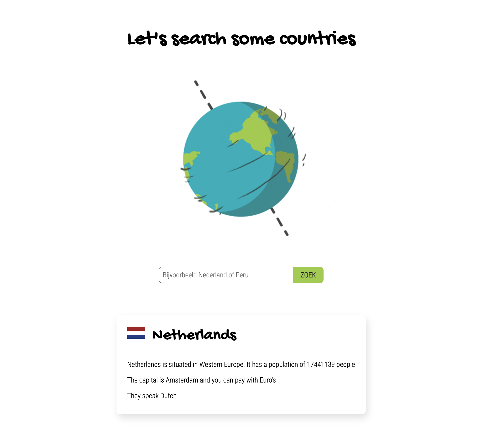

# Opdrachtbeschrijving

## Inleiding

Jouw Country Information App was een grote hit bij Constantijn. Hij moest echter wel lang scrollen en scannen naar de
juiste informatie voor hij onschuldige voorbijgangers kon imponeren met zijn kennis. Hij heeft jou daarom gevraagd of je
een zoek-functionaliteit kunt inbouwen zodat hij naar landen kan zoeken en zo direct allerlei informatie te zien krijgt.



Je gaat dit wederom doen met behulp van de REST Counties API. De documentatie over de verschillende endpoints kun
je [hier](https://restcountries.com/#api-endpoints-v2-all) vinden. Bekijk deze documentatie goed. _Let op:_ we raden je
aan om gebruik te maken van de endpoints uit versie 2 (versie 3 is nog niet zo betrouwbaar).

## Voor je begint

1. Je kunt gewoon verder werken in de opdracht van vorige week, door een extra HTML-bestand aan te maken en hier
   vanaf `index.html` naartoe te linken. Heb je vorige week _geen_ opdracht gemaakt? Clone dan dit project.
2. Het bestaande CSS- en JavaScript bestand zijn nog niet gekoppeld aan het HTML-bestand. Dit mag je zelf doen.
3. Schrijf voor alle opdrachten eerst **stap voor stap de psuedo-code uit**. Begin dan pas met programmeren. Ik meen
   het.
4. NPM en Parcel zijn al geconfigureerd, maar je moet de bijbehorende dependencies nog wel _installeren_.
   De `node_modules` map wordt immers niet meegepusht naar GitHub. Omdat er een `package.json` aanwezig is in het
   bestand, kun je dit doen met het volgende (globale) commando:

```shell
npm install
```

Alle benodigde dependencies zijn nu binnengehaald! Als je de applicatie wil starten, doe je dat met het volgende
commando:

```shell
npm run start
```

_Tip_: wanneer je gebruik gaat maken van Axios zul je dit nog wel los moeten installeren, want deze staat nog niet in
de `package.json`.

## Randvoorwaarden

* Op basis van de informatie uit de REST Countries API, haal je data op over één specifiek land per keer;
* Kies één land om mee te beginnen. Zorg ervoor dat de opgehaalde data op de volgende manier wordt weergegeven op de
  pagina:

```
[IMAGE: flag]
[country-name]
[country-naam] is situated in [subarea-name]. It has a population of [amount] people.
The capital is [city] and you can pay with [currency]'s
```

* Houdt er rekening mee dat de meeste landen maar één valuta hebben, maar sommige landen (zoals Panama) hebben er twee.
  In dat geval moet er: `and you can pay with [currency] and [currency]'s` komen te staan;
* Er staat een zoekbalk op de pagina waarmee de gebruiker naar een land kan zoeken. De zoekopdracht wordt
  _getriggered_ zodra de gebruiker op de 'zoek'-knop klikt of op ENTER drukt. De inhoud van het invoerveld wordt na
  iedere zoekopdracht geleegd;
* Wanneer de gebruiker zoekt naar een land dat niet bestaat, wordt er een foutmelding getoond. Wanneer de gebruiker
  daarna een nieuwe zoekopdracht maakt die wel correct is, moet de foutmelding weer verdwenen zijn.

## Stappenplan

_Let op_: het is uitdagender om jouw eigen stappenplan te maken. Als je niet zo goed weet waar je moet beginnen, kun je
onderstaand stappenplan gebruiken:

1. Neem de documentatie van de REST Countries API goed door. Welk endpoint heb je nodig om informatie over één specifiek
   land op te halen, zoals `nederland`?
2. Schrijf een asynchrone functie die, met behulp van Axios, een GET-request maakt naar het juiste endpoint
   voor `nederland`. Log de response in de console en bestudeer de data goed: hoe is het opgebouwd?
3. Probeer eens om de _naam_ en _populatie_ van het land te loggen in de console. Welk pad moet je hiervoor volgen?
4. Maak een `<article>`- of `<div>`-tag in de HTML die je als referentie kunt gebruiken in jouw JavaScript bestand;
5. Zorg ervoor dat de _naam_ van het land weergegeven wordt in bovenstaande tag;
6. Zorg er nu voor dat de zin `[country-naam] is situated in [subarea-name]. It has a population of [amount] people.`
   daaronder wordt weergegeven;
7. Zorg ervoor dat er een afbeelding van een vlag naast de naam van het land komt te staan;
8. Schrijf een functie die, ongeacht of er één of twee valuta's gebruikt worden, eenn string teruggeeft. _Tip_: dit kun
   je checken door bijvoorbeeld de informatie over `panama` op te halen.
    - **1 valuta**: `and you can pay with [currency]'s`
    - **2 valuta's**: `and you can pay with [currency]'s and [currency]'s`
9. Gebruik deze functie de correcte zin, `The capital is [city] and you can pay with [currency] and [currency]'s` weer
   te geven.
10. Maak een inputveld met zoek-knop op de pagina. In plaats van dat de data wordt opgehaald wanneer de pagina laadt,
    zorg je er nu voor dat de data over Nederland pas wordt opgehaald wanneer de gebruiker op ENTER of 'Zoek' drukt;
11. Zorg ervoor dat de waarde uit het inputveld wordt gebruikt als dynamische waarde in jouw GET-request;
12. Zorg ervoor dat de waarde van het input veld wordt leeggemaakt na elke zoekopdracht en dat er altijd maar één
    zoekresultaat op de pagina staat;
13. Zorg ervoor dat als er naar een land wordt gezocht dat niet bestaat, er een foutmelding wordt getoond. _Tip_: als er
    een ongeldige API call wordt gemaakt, zal de response in het catch blok terecht komen.
14. Zorg er ook voor dat wanneer er daarna een geldig verzoek wordt gedaan, de foutmelding weer verdwenen is.

## Bonusopdrachten

- Maak een functie die ongeacht het aantal talen die in een land gesproken worden, een string maakt. Voeg deze string
  toe aan de informatie die je per land op de pagina weergeeft:
    - 1 taal: `They speak [language]`
    - 2 talen: `They speak [language] and [language]`
    - 3 talen: `They speak [language], [language] and [language]`
    - etc.
- Make it look nice! 😍